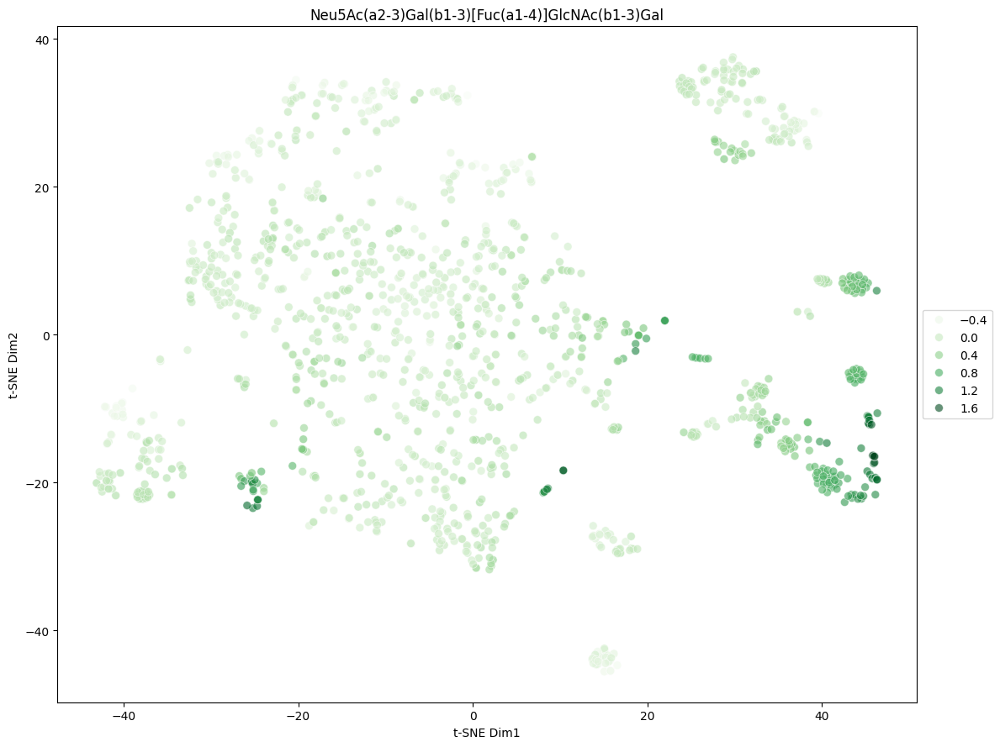

# Summary

This repository leverages the glycowork package to analyze lectin-glycan interactions, with applications in nanobiosensor development for pancreatic cancer detection. Glycoinformatics is the computational study of glycans and is critical because:

 - Glycans (sugar chains) decorate cell surfaces and play key roles in cancer progression, immune evasion, and metastasis
 - Lectins are proteins that bind glycans with high specificity making them ideal for nanobiosensor design where lectins act as biorecognition elements to capture cancer-associated glycans.

This project aims to analyse and apply glycowork's deep learning models to find lectins that are specific to CA 19-9 with the sialyl-lewis A (sLeA) motif. Currently, the most well understood class of lectins that bind to sLeA are selectins. Using generative models to simulate protein structures that mimic selectins could be useful in generating novel proteins that have similar function which can then be repurposed as nanobiosensors.

# Steps to Understand Analysis 

- Start with `ESM Embeddings.ipynb` which explains how the amino acid sequences are converted to vector embeddings leveraging `ESM2`.
- `Reproducing LectinOracle.ipynb` simply retrains a model with similar architecture as the one used in `glycowork`. I did this to make sure I understood the details of how this model worked.
- `Exploring Glycowork.ipynb` is just preliminary exploration of the package `glycowork` which is used extensively in this project. In fact, all dataset curation is done (not by me) but by the authors of the package. See references.
- `NCBI ID.ipynb` is the start towards some further data integration.

# Future Work
- Use BLAST to find more sequences similar to human lectins.
- Develop more model architectures and evaluate them comparing to `LectinOracle`.
- Leverage `pdb` format info and not just amino acid sequence information to train models. 

# References 
-  https://bojarlab.github.io/glycowork/core.html
-  Lundstrøm, J., Korhonen, E., Lisacek, F., Bojar, D., 2022. LectinOracle: A Generalizable Deep Learning Model for Lectin–Glycan Binding Prediction. Advanced Science 9, 2103807. https://doi.org/10.1002/advs.202103807
